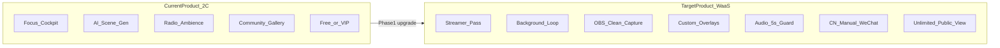

# Time Loop AI：現況 vs WaaS 直播主版 — 功能差距與改進規劃

## 硬性產品策略（不可協商）

| 規則 | 說明 |
|------|------|
| **一般訪客不限時觀看** | 主站與 `?stream=1` **不設 60 秒試看門檻**。流量與觀看時長是核心績效指標，必須讓人盡可能多看、多分享。 |
| **Streamer Pass 賣創作者工具，不賣「解除限時」** | 付費解鎖：自定義圖庫上傳、Overlay 編輯、背景輪播設定、去水印等 **創作者能力**；非付費者仍可 **無限觀看** 完整直播間體驗。 |
| **不做 Affiliate / 加盟商分潤** | 音樂直播受眾有限，開放大量加盟商只會分散品牌、打爛市場。**集中直營招募高粉直播主**，不建分潤網絡、不發 `?aff=` 專屬連結。 |

> **程式修正項（2026-06-08 已完成）：** 已移除 `streamPreviewExpired` 60 秒 gate 與 Affiliate API/Webhook。

---

## 目標客群（Phase 1 鎖定）

**3–5 萬粉絲高價值網美 / 跨國直播主**（抖音、小紅書、TikTok Live、YouTube Live、Twitch）。

| 痛點 | 他們需要 | Time Loop 提供 |
|------|----------|----------------|
| 無技術、畫面同質化 | 獨特 3D 賽博直播間 | 粒子特效 + 圖庫輪播 |
| 版權音樂風險 | 24h 合法 BGM | SomaFM + CN 代理 |
| 24h 無人直播穩定 | 音訊不斷、畫面自動換 | **P0 音訊防斷流 + 輪播** |
| 引流轉粉 | 畫面內 CTA | **P0 八語 Overlay 範本 + Emoji** |
| 跨境收款 | 全球 Lemon + 大陸替代 | **P0 CN 金流對策**（直營開通，無加盟商） |

---

## 現況定位（Today）



**一句話：** 現有 App 是 **2C 效率工具**；本計劃升級為服務高粉直播主的 **WaaS 直播主工具**，Phase 1 必須達到「24h OBS 投屏零感知、音不斷、畫面獨特、可引流、**大眾不限時可看**、可跨境收款」。

---

## 已具備、與直播主模式高度契合的能力

| 能力 | 現況 | 對高粉直播主的價值 |
|------|------|-------------------|
| **3D 粒子 / 視覺特效** | [`ParticleLayer`](components/ui/ParticleLayer.tsx) + 六種即時特效 | 質感降維打擊 2D 循環動畫 |
| **24h 電台 + 環境音** | [`StreamAudioPlayer`](components/stream-audio-player.tsx) + tier fallback | 開播即用；**需加強 stream 模式 5s 守護** |
| **大陸串流代理** | [`stream-proxy` Worker](workers/stream-proxy/src/index.ts) | 抖音/小紅書可用 |
| **十語系 i18n** | [`translations.ts`](lib/translations.ts) 10 語系（含 **th / vi**） | 跨國直播 + 東南亞；**需加 streamerOverlay 範本** |
| **6 Mood + DJ** | [`music-moods.ts`](lib/music-moods.ts) | 市場 preset 基礎 |
| **AI 生圖 + 社群** | generate + publish + gallery | 獨特背景資產 |
| **Lemon Squeezy** | checkout + webhook | 全球訂閱；**CN 需替代管道** |
| **前端 WebGL 渲染** | 用戶本機 GPU | 邊際成本趨近零 |

---

## 關鍵差距（含新增 P0 四項）

### B+. Phase 1 新增 P0（高粉直播主必備）

| P0 項目 | 需求 | 現況 | Phase 1 交付 |
|---------|------|------|--------------|
| **音訊防斷流守護** | `?stream=1` 下 5 秒內無感重連，24h 穩定 | [`StreamAudioPlayer`](components/stream-audio-player.tsx) 已有 20s stall 檢查 + 3 次 soft reconnect + [`handleStreamFailure`](hooks/use-music-station.ts) tier fallback | **`streamMode` 參數**：stall 閾值 5s、無限 soft reconnect、雙路 audio crossfade 不間斷 |
| **Overlay + Emoji + 八語範本** | 自定義 CTA + 預設深夜引流文案 | 無 overlay；translations 無 streamer 區塊 | `streamOverlay` i18n 範本 + UTF-8 Emoji 渲染 + 一鍵套用 |
| **大陸金流對策** | cn 站避開 Lemon 加載硬傷 | CN 僅隱藏 VIP、推 Credits（仍走 Lemon） | cn 後台提示「手動開通 / 微信對接」+ 管理員 API 開通 streamer |
| **公開不限時觀看** | 流量績效優先 | 誤實作 60s preview gate | **移除** `streamPreviewExpired`；`?stream=1` 對所有人開放 |

---

### B. Streamer Pass 核心功能（付費創作者 vs 免費觀眾）

| 功能 | 免費觀眾 / 一般訪客 | Streamer Pass 付費創作者 |
|------|---------------------|--------------------------|
| 主站 + `?stream=1` 觀看 | **不限時** | 同左 |
| OBS 純淨布局 | ✓ | ✓ |
| 音訊 5s 防斷流（stream 模式） | ✓ | ✓ |
| 預設 Overlay 八語範本（唯讀展示） | ✓ | ✓ |
| 自定義 Overlay 編輯 | ✗ | ✓ |
| 自定義圖庫 5–10 張上傳 | ✗ | P0 |
| 背景自動輪播 cross-fade | ✗（或僅預設圖） | P0 |
| CN 手動/微信金流開通 | — | **P0** |
| 去浮水印 / 品牌 logo | ✗ | P1 |

| 功能 | 現況 | 差距 |
|------|------|------|
| 公開不限時觀看 | 誤有 60s gate | **須移除** |
| Affiliate / 加盟商 | 誤已實作 | **須移除 — 明確不做** |

---

### A. 商業分層（Phase 2，Phase 1 先 soft gate）

| 方案 | 全球 | 大陸 cn.timeloopai.net |
|------|------|------------------------|
| Free | 5 次/月 | 同左 |
| VIP ~$4.99 | Lemon Squeezy | **不展示 Lemon**；Credits 或手動 |
| Streamer ~$29.99 | Lemon 第三 variant | **手動開通 + 微信**（Phase 1 UI + admin API） |
| Credits | Lemon pack | 微信/支付寶人工充值記帳（Phase 1 提示 + Phase 2 自動化） |

---

## Phase 1 — Streamer Pass MVP（4–6 週）

**目標 URL：** `https://app.timeloopai.net/?stream=1`  
（大陸：`https://cn.timeloopai.net/?stream=1`）

**一般觀眾**打開後：**不限時**觀看完整直播間（音樂、粒子、預設 Overlay）。  
**付費 Streamer** 額外得到：**自定義圖庫輪播、Overlay 編輯、去水印** 等創作者工具。

---

### 1. OBS / Stream 模式 + 音訊防斷流守護（P0）

**Stream 模式**

- URL：`?stream=1` 或路由 `/stream`（**不**使用 `?aff=` 參數）
- 隱藏：左右面板、NowPlaying、DJ、Region prompt、生成 UI、Sponsored
- 保留：背景、粒子、音樂、ambience、Overlay
- 檔案：[`time-loop-page.tsx`](components/timeloop/time-loop-page.tsx)、新建 `components/stream/stream-layout.tsx`

**音訊防斷流守護（P0 細規）**

現有 [`StreamAudioPlayer`](components/stream-audio-player.tsx) 常數：
- `STALL_CHECK_MS = 20000`（過長，不適合 24h 直播）
- `MAX_SOFT_RECONNECTS = 3`（過少）

**Stream 模式強化規格：**

| 項目 | 一般模式 | `streamMode=true` |
|------|----------|-------------------|
| Stall 偵測 | 20s | **5s**（無 `timeupdate` / `progress`） |
| Soft reconnect | 最多 3 次 | **無上限**（指數退避上限 30s） |
| 重連策略 | reload 同一 URL | reload → cache-bust `?t=` → 觸發 [`handleStreamFailure`](hooks/use-music-station.ts) tier 升級 |
| 聽感 | 允許短暫靜音 | **雙 `<audio>` crossfade**（已有 2.2s）— 重連在 inactive 軌道預載，active 軌淡出 |
| 監控 | 無 UI | 可選 dev overlay：`audioStatus: playing / reconnecting / fallback`（stream 模式預設隱藏） |
| Ambience 循環 MP3 | 同邏輯 | 同 5s 守護套用第二路 [`StreamAudioPlayer`](components/timeloop/time-loop-page.tsx) ambience |

**實作要點：**

```typescript
// StreamAudioPlayer 新增 prop
streamMode?: boolean  // true → STALL_CHECK_MS = 5000, unlimited soft reconnect

// use-timeloop-page.ts
const isStreamMode = searchParams.get('stream') === '1'
```

**驗收：** 人為斷網 / 殺掉 stream 5–10 秒，OBS 畫面音訊在 5 秒內恢復，無明顯爆音或長時間靜音。

---

## 硬性產品邏輯：東南亞 th / vi 市場（AI DJ 語音）

> **不可協商規則（Hard Rule）** — 實作見 [`lib/dj-speech-locale.ts`](lib/dj-speech-locale.ts) 之 `djSpeechLocaleForUiLocale()` / `SEA_EN_DJ_VOICE_LOCALES`。

針對 **泰語（th）** 與 **越南語（vi）** 市場：

| 層級 | 語言策略 |
|------|----------|
| **前端 UI** | 100% 渲染本地語言（泰文 / 越南文）— 控制面板、onboarding、會員區、社群、Companion 等 |
| **Streamer Overlay** | 100% 本地語言 — 自定義 CTA、`streamerOverlay` 範本、Emoji 引流文案（[`lib/streamer-overlay-templates.ts`](lib/streamer-overlay-templates.ts)） |
| **AI DJ 語音（TTS）** | **硬性綁定高階英語（EN）** — Web Speech / TTS `lang` 固定 `en-US`，不使用 th-TH / vi-VN 語音 |
| **AI DJ 口播文案（LLM + fallback）** | **硬性英語** — greet API 指令、本地 fallback 均走 EN 治癒系 / 深夜人設（與 [`djEn`](lib/dj-i18n.ts) 同源） |

**設計理由：**

1. 規避東南亞本地 TTS 機械感過重、品質不穩的問題
2. 深夜直播間以 **國際化格調** 定位（English healing / late-night persona），契合 TikTok Live / 跨國觀眾混流場景
3. UI 仍完全本地化，降低泰國 / 越南主播操作門檻

**驗收：**

- 語言切換為 **ไทย** 或 **Tiếng Việt** 後，介面與 Overlay 範本為泰文 / 越南文
- 開啟 DJ 語音後，口播為 **英語**（字幕同步英語），TTS 不出泰文 / 越南文機器音
- 切換至 ja / ko 等其他語系時，DJ 仍跟隨該語系（不受此規則影響）

---

### 2. Overlay 升級：Emoji + 十語深夜引流範本（P0）

**功能**

- 欄位：`overlayLine1`、`overlayLine2`、`position`（tl/tr/bl/br）、`opacity`、`enabled`
- **必須支援 Emoji**（UTF-8 完整字串，禁止 HTML strip；CSS `font-family` 含 system emoji fallback）
- 儲存：`streamer_settings` JSON 或新表（與 user_id 1:1）
- 渲染：[`components/stream/stream-overlay.tsx`](components/stream/stream-overlay.tsx)（新建），`pointer-events-none`，z-index 在 3D 背景之上

**十語預設範本（[`lib/streamer-overlay-templates.ts`](lib/streamer-overlay-templates.ts) + [`translations-sea.ts`](lib/translations-sea.ts)）**

每語系至少 3 組「深夜專注 + 引流」一鍵套用：

| 語系 | 範例 line1 | 範例 line2 |
|------|------------|------------|
| en | 🌙 Late-night focus room | ✨ Follow for daily calm streams |
| zh-TW | 🌙 深夜專注艙 | ✨ 追蹤不迷路｜主頁有驚喜 |
| zh-CN | 🌙 深夜专注舱 | ✨ 关注不迷路｜主页有惊喜 |
| ja | 🌙 深夜の作業用BGM | ✨ フォローで毎夜配信 |
| ko | 🌙 심야 집중룸 | ✨ 팔로우하고 함께해요 |
| es | 🌙 Sala nocturna | ✨ Sígueme — link en bio |
| fr | 🌙 Salle de focus | ✨ Abonne-toi — lien en bio |
| de | 🌙 Nacht-Fokusraum | ✨ Folge für Daily Streams |
| **th** | 🌙 ห้องโฟกัสยามดึก | ✨ ติดตามไม่หลง — ลิงก์ในไบโอ |
| **vi** | 🌙 Phòng tập trung đêm khuya | ✨ Theo dõi — link trong bio |

**UI：** Streamer 設定面板提供「套用範本」下拉（依 [`useLanguage`](lib/language-context.tsx) 預選當前語系，可切換其他語系範本）。

**驗收：** 選繁中範本後 Overlay 顯示 🌙 + 繁中 CTA；切換 en 範本即時更新；Emoji 在 OBS Browser Source 正常顯示。

---

### 3. ~~Affiliate 推薦碼~~ — **已取消（Out of Scope）**

**產品決策：** 不做加盟商 / BD 分潤網絡。音樂直播受眾池有限，開放大量 Affiliate 只會分散品牌、互相殺價。

**計畫修正：**

| 項目 | 原 Phase 1 誤規劃 | 修正後 |
|------|-------------------|--------|
| `?aff=slug` URL | P0 | **移除**，不再文檔化或推廣 |
| `lib/affiliate.ts`、attach/resolve API | 已實作 | **回退或停用**（保留 DB 表無害，但前端不再捕獲） |
| Lemon webhook `affiliate_conversions` | 已實作 | **停止寫入** |
| Phase 3 分潤報表 | 規劃中 | **永久取消** |

**招募策略改為直營：** 官方直接觸達 3–5 萬粉直播主（抖音 / 小紅書 / TikTok / YouTube），一對一開通 Streamer Pass，**人數可控**。

---

### 4. 大陸金流對策（P0 — cn.timeloopai.net）

**問題：** Lemon Squeezy checkout 在中國大陸常遇加載失敗、支付渠道不可用；高粉抖音/小紅書主播無法順利付 Streamer Pass。

**Phase 1 策略（不阻塞招商，先可人工閉環）**

| 場景 | 行為 |
|------|------|
| 宿主 `cn.timeloopai.net` 或 region=cn | **完全不載入 Lemon checkout iframe/redirect** |
| Streamer Pass CTA | 改為「聯繫開通」+ 展示微信 QR / 客服微信號（env：`CN_WECHAT_SUPPORT_ID`） |
| 後台提示文案 | Control Panel 會員區：「大陸創作者請添加微信 XXX，備註 UID 手動開通 Streamer Pass」 |
| 管理員開通 | `POST /api/admin/grant-plan`（service role）：`user_id` + `plan=streamer` + `vip_until` + 備註 `source=wechat_manual` |
| Credits 充值 | 同流程人工記帳 + admin 加點（[`credit_transactions`](supabase/schema.sql) type=`admin`） |

**UI 檔案**

- [`components/billing/cn-manual-upgrade-panel.tsx`](components/billing/cn-manual-upgrade-panel.tsx)（新建）
- 條件渲染：`preferCreditPack || isCnHost` 時替換 [`onCheckout('subscription')`](components/control-panel.tsx)

**Phase 2 延伸（文檔預留，不阻塞 Phase 1）**

- 微信支付 Native / 小程序收付通
- 或 Paddle / 國內聚合支付（需 ICP + 主體）

**驗收：** cn 站點點「升級 Streamer Pass」不出 Lemon 錯誤；顯示微信開通指引；admin grant 後該用戶可使用 stream 模式 + 圖庫。

---

### 5. 圖庫 + 自動輪播（Phase 1 核心，維持原 spec）

- 表 `streamer_backgrounds`（user_id, storage_path, sort_order, source: upload|generated）
- API：`POST /api/streamer/backgrounds`（multipart → Supabase bucket，上限 10 張）
- Timer：5/10 分鐘可調；复用 [`ambient-background.tsx`](components/timeloop/ambient-background.tsx) crossfade
- 輪播只換 `backgroundImage`，粒子 preset 不變

---

### 6. 權限門檻（Phase 1 — 觀看開放、工具付費）

| 角色 | `?stream=1` 觀看 | 創作者工具 |
|------|------------------|------------|
| **未登入 / Free / VIP** | **不限時** — 完整音樂 + 粒子 + 預設 Overlay | 不可上傳圖庫、不可編輯 Overlay |
| **Streamer Pass** | 同左 | 圖庫上傳、輪播設定、Overlay 編輯、去水印 |

**移除誤規劃：** ~~非 Streamer 進入 `?stream=1` 可預覽 60 秒，之後 overlay 提示升級~~ — 此邏輯與「流量績效優先」衝突，**必須刪除** `use-timeloop-page.ts` 內 60s timer 與 `streamPreviewExpired` UI。

**升級 CTA 改位：** 不在觀看中遮罩打斷；改在 Control Panel / 設定區提示「升級 Streamer Pass 解鎖自定義背景與 Overlay」。

---

### Phase 1 完整開發清單（含 P0 三項 + 兩項修正）

| # | 項目 | 優先級 | 關鍵檔案 |
|---|------|--------|----------|
| 1 | `?stream=1` OBS 純淨布局 | P0 | `stream-layout.tsx`, `time-loop-page.tsx` |
| 2 | **音訊 5s 防斷流 `streamMode`** | **P0** | `stream-audio-player.tsx`, `use-music-station.ts` |
| 3 | **Overlay Emoji + 八語範本** | **P0** | `translations.ts`, `stream-overlay.tsx` |
| 4 | **CN 手動/微信金流 UI + admin grant** | **P0** | `cn-manual-upgrade-panel.tsx`, `api/admin/grant-plan` |
| 5 | 圖庫 upload + 輪播 | P0 | `streamer_backgrounds`, upload API |
| 6 | **移除 60s 試看 gate** | **P0 修正** | `use-timeloop-page.ts`, `time-loop-page.tsx` |
| 7 | **移除 Affiliate 捕獲** | **P0 修正** | `lib/affiliate.ts`, `api/affiliate/*`, webhook |
| 8 | `streamer_settings` CRUD | P1 | streamer 設定 API |
| 9 | Streamer 創作者工具 gate | P1 | entitlement check（僅 gate 上傳/編輯，不 gate 觀看） |

**建議實作順序：**

1. **移除 60s gate + Affiliate**（與產品策略對齊，優先）
2. `?stream=1` 布局（可立刻 OBS 測試）
3. 音訊 5s 防斷流（24h 穩定性底線）
4. Overlay + 八語範本（引流價值可感知）
5. CN 金流 UI + admin grant（大陸主播可付費）
6. 圖庫輪播（畫面獨特化閉環）

---

### Phase 1 成功指標（高粉直播主驗收）

1. **24h 穩定：** OBS Browser Source 連續運行 8h+，模擬斷流後 **5 秒內**音訊恢復
2. **引流就绪：** 一鍵套用八語 Overlay 範本，Emoji 正常，OBS 擷取清晰
3. **流量開放：** 一般訪客 `?stream=1` **無時間限制**，可長時間觀看、分享
4. **大陸可付：** cn 站主播透過微信人工開通後，創作者工具全功能可用，無 Lemon 報錯
5. **畫面獨特：** Streamer 上傳 5–10 張圖庫每 N 分鐘 cross-fade，粒子不斷
6. **無加盟商：** 無 `?aff=` 推廣、無分潤後台 — 直營招募可控人數

---

## Phase 2 — 商業閉環（進行中）

- 三層訂閱 Free / VIP / Streamer + Lemon 第三 variant（**全球**；CN 仍走 manual）
- Credits 10/20 點分級（Lemon variant + 生图 10 点消耗）
- 修復 VIP 文案、`past_due` 保留权限、server-side download
- Streamer Pass 權限矩陣：**只 gate 創作者工具**，觀看永遠開放
- **大陸直播主付費**：微信預付 + `grant-plan` + 控制面板顯示 `vipUntil` / 月季年方案說明（不做自動月扣）

### Phase 2 實作清單

| # | 項目 | 狀態 |
|---|------|------|
| 1 | Lemon Streamer variant checkout + webhook plan 映射 | 已完成 |
| 2 | Credits 10/20 pack checkout + webhook | 已完成 |
| 3 | 生图 10 credits / VIP·Streamer 无限 | 已完成 |
| 4 | `past_due` 仍保留 VIP/Streamer 权限 | 已完成 |
| 5 | `MembershipPanel` + Streamer 升级按钮 | 已完成 |
| 6 | CN 预付费方案文案 + vipUntil 显示 | 已完成 |
| 7 | `POST /api/download/background` 服务端下载 | 已完成 |
| 8 | GitHub Secrets: `LEMON_SQUEEZY_STREAMER_VARIANT_ID` 等 | 待配置 |

---

## Phase 3 — Streamer Studio

- Streamer 後台、Market Presets、**官方**策展畫廊
- 白標、vi/th 語言深化
- ~~Affiliate 報表 / 提現~~ — **不做**

---

## Phase 4 — 護城河

- OBS WebSocket 熱鍵、analytics、Sponsored 真實投放

---

## Quick Wins（可並行）

1. 部署社群 3×7 問號格
2. Publish UI 補齊 metadata
3. Health billing 監控 Streamer variant

---

## 商業模式可行性（更新）

- **高粉直播主**付 $29.99/月換 24h 穩定 + 獨特畫面 + 引流 Overlay **創作者工具** → ROI 明確
- **一般觀眾不限時觀看** → 最大化平台流量與分享傳播，績效指標優先
- **直營招募、不做 Affiliate** → 受眾池有限，集中品牌、控制直播主數量，避免加盟商互相殺價
- **CN 微信人工開通** 解決 Lemon 硬傷，不阻塞大陸直營招商
- **前端渲染** 邊際成本仍趨近零 — WaaS 論述成立

**Phase 1 真正缺口（更新後）：** OBS 模式、**5s 音訊守護**、**Emoji 八語 Overlay**、**CN 金流**、圖庫輪播、**移除 60s gate**、**移除 Affiliate** — 七項對齊產品策略。
