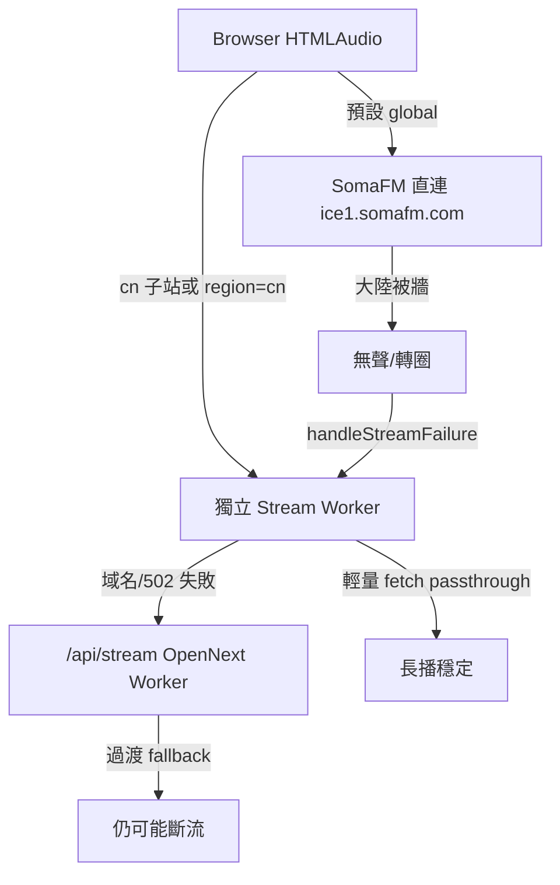

# 大陸音樂收聽修正方案

## 現況校正（與報告差異）

| 報告描述 | 實際 repo 狀態 |
|---------|----------------|
| 託管在 Vercel | **已部署 Cloudflare Workers（OpenNext）** — 見 [`.github/workflows/deploy-cloudflare.yml`](.github/workflows/deploy-cloudflare.yml)、[`wrangler.jsonc`](wrangler.jsonc) |
| cn 子站需另配 Vercel DNS | [`wrangler.jsonc`](wrangler.jsonc) **已宣告** `cn.timeloopai.net` custom domain；若無法跳轉，多半是 **Cloudflare DNS/路由未生效**，非程式缺路由 |
| 只有選 cn 才走代理 | 部分正確：首次播放預設 **直連** [`buildStreamPlaybackUrl`](lib/radio-station.ts)；失敗後 [`handleStreamFailure`](hooks/use-music-station.ts) 會 `setStreamViaProxy(true)` 改走 `/api/stream` |

**根因（技術）**



- 環境音 `/ambience/*.mp3` 為靜態資源，**無需改動**。
- 問題集中在 **境外直播流** + **代理層不適合長連線**。

已確認策略：**大陸 IP 主站自動代理 + 保留 cn 子站分流**（`timeloop-region=global` 仍尊重用戶 opt-out）。

---

## 上線優先級

| 優先級 | 階段 | 目標 |
|--------|------|------|
| **P0 + P1（緊急）** | DNS + Stream Worker + 前端 URL 切換 | 大陸用戶手動選 cn / 已在 cn 子站 → **穩定長播**；主站可靠播放失敗 fallback |
| **P2（次優先）** | Geo 自動代理 + RegionPrompt 擴充 | 降低大陸用戶操作門檻，主站未選 region 即走代理 |
| **P4** | 全場景驗收 | 含異常 fallback |

---

## P0 — 基礎設施

### 1. DNS（報告 BUG1）

在 Cloudflare Dashboard（`timeloopai.net` zone）：

- `cn.timeloopai.net` → 綁定 **主 Worker** custom domain（與 `app.timeloopai.net` 相同服務），**橙雲**。
- `stream.timeloopai.net` → 綁定 **獨立 stream Worker**，**橙雲**。
- 勿指向 `cname.vercel-dns.com`。
- 驗證 `NEXT_PUBLIC_CN_SITE_URL=https://cn.timeloopai.net` 與 GitHub Secrets 一致。

### 2. 獨立 Stream Worker（報告 BUG2 核心）

- 目錄建議：`workers/stream-proxy/` + [`wrangler.stream.jsonc`](wrangler.stream.jsonc)
- Worker 名稱：`timeloop-stream-proxy`
- 域名：`stream.timeloopai.net`

**參考實作（可直接作為 v1 起點）**

```typescript
// workers/stream-proxy/src/index.ts
const ALLOWED_HOST_SUFFIXES = [
  'somafm.com',
  // P0 後從 lib/radio-browser-server 整理 Radio Browser 常見 host 追加
]

function isAllowedHost(hostname: string): boolean {
  const host = hostname.toLowerCase()
  return ALLOWED_HOST_SUFFIXES.some((suffix) => host === suffix || host.endsWith(`.${suffix}`))
}

export default {
  async fetch(request: Request): Promise<Response> {
    if (request.method === 'OPTIONS') {
      return new Response(null, {
        headers: {
          'Access-Control-Allow-Origin': '*',
          'Access-Control-Allow-Methods': 'GET, HEAD, OPTIONS',
        },
      })
    }

    const url = new URL(request.url)
    const upstreamRaw = url.searchParams.get('url')
    if (!upstreamRaw) return new Response('Missing url param', { status: 400 })

    let upstreamUrl: URL
    try {
      upstreamUrl = new URL(upstreamRaw)
    } catch {
      return new Response('Invalid url', { status: 400 })
    }

    if (upstreamUrl.protocol !== 'http:' && upstreamUrl.protocol !== 'https:') {
      return new Response('Invalid protocol', { status: 400 })
    }

    if (!isAllowedHost(upstreamUrl.hostname)) {
      return new Response('Forbidden host', { status: 403 })
    }

    try {
      const upstreamRes = await fetch(upstreamUrl.toString(), {
        headers: {
          'User-Agent': 'TimeLoopAI-StreamProxy/1.0',
          Accept: 'audio/mpeg,audio/*,*/*',
        },
        cf: { cacheTtl: 0 },
        redirect: 'follow',
      })

      if (!upstreamRes.ok || !upstreamRes.body) {
        return new Response('Upstream failed', { status: 502 })
      }

      const headers = new Headers(upstreamRes.headers)
      headers.set('Access-Control-Allow-Origin', '*')
      headers.set('Cache-Control', 'no-store')

      return new Response(upstreamRes.body, {
        status: upstreamRes.status,
        headers,
      })
    } catch {
      return new Response('Proxy failed', { status: 500 })
    }
  },
} satisfies ExportedHandler
```

**CI**：新增 [`.github/workflows/deploy-stream-proxy.yml`](.github/workflows/deploy-stream-proxy.yml)（或併入現有 workflow 第二個 `wrangler deploy -c wrangler.stream.jsonc` job）。

---

## P1 — 前端串流 URL 改造（緊急）

### 修改 [`lib/radio-station.ts`](lib/radio-station.ts)

1. 新增 env：`NEXT_PUBLIC_STREAM_PROXY_URL`（例：`https://stream.timeloopai.net`）

2. `buildProxiedStreamUrl` 優先級：

```typescript
const external = process.env.NEXT_PUBLIC_STREAM_PROXY_URL?.replace(/\/$/, '')
if (external) {
  return `${external}?url=${encodeURIComponent(station.urlResolved)}`
}
return `/api/stream?url=${encodeURIComponent(station.urlResolved)}` // dev / fallback
```

3. **P1 階段** `shouldPreferStreamProxy()` 至少涵蓋（無需等 P2）：

| 條件 | 行為 |
|------|------|
| `hostname.startsWith('cn.')` | 代理 |
| `localStorage timeloop-region === 'cn'` | 代理 |
| `localStorage timeloop-region === 'global'` | 不強制代理 |
| 其他 | 直連 → [`handleStreamFailure`](hooks/use-music-station.ts) fallback 代理 |

4. **Stream Worker 失敗 → 降級 `/api/stream`**（P1 必做）  
   在 [`handleStreamFailure`](hooks/use-music-station.ts) 增加一層：若當前 playback URL 為 `NEXT_PUBLIC_STREAM_PROXY_URL` 前綴且仍失敗，改試同源 `/api/stream?url=...`（標記 `timeloop-stream-proxy-fallback=1` 避免無限循環）。

5. 移除未使用的 `uuid` query（route 未讀取）。

### 環境變數

- [`.env.production.example`](.env.production.example)、GitHub Secrets、[`.github/workflows/deploy-cloudflare.yml`](.github/workflows/deploy-cloudflare.yml)：
  - `NEXT_PUBLIC_STREAM_PROXY_URL=https://stream.timeloopai.net`

---

## P2 — 大陸 Geo 偵測（次優先，體驗增強）

### 新增 [`app/api/geo/route.ts`](app/api/geo/route.ts)

- 讀 `cf-ipcountry`（Cloudflare Workers 標準 header）
- 回傳：`{ country: string, suggestCn: boolean }`（首版 `suggestCn = country === 'CN'`）

### Geo 快取與異常降級

**localStorage 快取**（避免每次載入都打 `/api/geo`）：

- key：`timeloop-geo-country`
- 寫入時機：`/api/geo` 成功回傳
- 讀取時機：`shouldPreferStreamProxy()`、RegionPrompt 判斷
- TTL 建議：24h（可加 `timeloop-geo-fetched-at` timestamp，過期再 re-fetch）

**`/api/geo` 失敗降級**（網路錯誤 / 非 CF 環境）：

1. 若已有 `timeloop-geo-country` → 沿用快取
2. 否則 fallback 至 **現有邏輯**：`navigator.language === 'zh-cn'` 才彈 RegionPrompt
3. 不因 geo API 失敗而阻塞進站或音樂初始化

### 修改 [`hooks/use-timeloop-page.ts`](hooks/use-timeloop-page.ts)

在已有 `timeloop-region` 時跳過 geo 流程。否則：

1. 先讀 localStorage 快取；過期或無快取 → `fetch('/api/geo')`
2. 若 `country === 'CN'` 且未選 region：
   - 寫入 `timeloop-geo-country`
   - 觸發 RegionPrompt（文案可加「偵測到你位於中國大陸」）
   - 音樂：`shouldPreferStreamProxy()` 讀 geo → **主站首次即代理**
3. 「切換中國入口」→ 現有 `chooseRegion('cn')` 跳 cn 子站
4. 「留在國際站」→ `timeloop-region=global`，關閉 geo 自動代理

### [`hooks/use-music-station.ts`](hooks/use-music-station.ts)

- geo / region 變更後重新 `setStreamViaProxy(shouldPreferStreamProxy())`

---

## P3 — `/api/stream` 過渡策略

- **短期**：local dev、stream worker 502、DNS 未生效時的 **第二層 fallback**
- **中期**：stream worker 穩定後，production 預設僅走外部 proxy；主 Worker `/api/stream` 可改 410 + 指向新 URL

---

## P4 — 驗證清單

### 正常場景

| 場景 | 預期 |
|------|------|
| 大陸 IP + 未選 region（P2 上線後） | Geo → 自動代理，音樂可播 |
| 手動選 cn / cn 子站（P1 即可驗） | stream worker 代理，長播穩定 |
| 選「留在國際站」 | 直連（可能無聲），符合 opt-out |
| 海外 IP | 直連 SomaFM |
| 連續播放 > 5 分鐘 | 不斷流 |
| 環境音 mp3 | 正常 |

### 異常場景（新增）

| 場景 | 預期 |
|------|------|
| `stream.timeloopai.net` 解析失敗 / 502 | 前端 fallback 至 `/api/stream`；若仍失敗 → 換台 / default mood |
| 白名單外 upstream URL | Worker 403；前端可選換台，**不** crash；可選 toast「此電台暫不支援代理」 |
| `/api/geo` 請求失敗 | 降級 zh-cn 語言判斷 + 沿用 geo localStorage 快取 |
| 用戶已選 `timeloop-region=global` | 忽略 geo 自動代理 |

**自測命令**

```bash
# 正常代理
curl -I "https://stream.timeloopai.net?url=https%3A%2F%2Fice1.somafm.com%2Fgroovesalad-256-mp3"

# 白名單拒絕（應 403）
curl -I "https://stream.timeloopai.net?url=https%3A%2F%2Fexample.com%2Fstream.mp3"
```

---

## 實作順序（最終）

1. **P0 + P1（緊急上線）**：DNS → stream worker → 前端 URL + worker→api fallback → 大陸手動 cn 路徑驗收
2. **P2**：Geo API + 快取 + 降級 + 主站自動代理
3. **P4**：全量驗收（含異常表）

## 不在本輪範圍

- 替換 SomaFM 為境內音源
- Phase 3 社群變現 / 金流
- 修改 ambience 靜態資源
