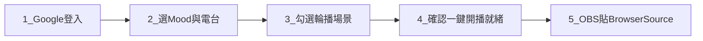

# Time Loop AI — 直播主快速上手（簡易版）

> **適用對象：** 已開通或即將開通 **Streamer Pass** 的直播主  
> **官方網址：** [app.timeloopai.net](https://app.timeloopai.net) · 中國入口：[cn.timeloopai.net](https://cn.timeloopai.net)  
> **完整說明：** [user-manual-zh-TW.md](user-manual-zh-TW.md)

---

## 這是什麼？

Time Loop AI 提供 **3D 沉浸背景 + 24h BGM 電台 + AI DJ 字幕/語音**，專為 OBS **Browser Source（瀏覽器來源）** 設計。  
你在駕駛艙選好音樂與輪播場景後，用 `?stream=1` 連結投屏，畫面乾淨、適合 24 小時無人直播。

---

## 開播前 5 步

| 步驟 | 操作 | 預期結果 |
|------|------|----------|
| **1** | 左側控制面板 → **Google 登入** | 顯示會員狀態；Streamer Pass 生效 |
| **2** | 完成音樂 Mood 引導；用 ◀ ▶ **選定要播的電台** | 聽到正確 BGM（此電台會同步到直播窗） |
| **3** | 右側畫廊 → **My** → 勾選 **≥1 張** 輪播場景 | 一鍵開播區顯示「輪播圖：N 張」就緒 |
| **4** | 左側 **一鍵開播** → **Launch OBS stream**，或 **複製直播連結** | 取得含 `?stream=1`（與 `&radio=...`）的 URL |
| **5** | OBS → 來源 → **Browser Source** → 貼 URL，**1920×1080** | 滿屏背景 + 音樂 + Overlay，**無瀏覽器標題列** |

> **重要：** 正式推流請用 OBS「瀏覽器來源」貼 URL。彈出預覽窗仍會有瀏覽器 X 列；OBS 內才會真正滿屏。

---

## 直播畫面會看到什麼？

| 位置 | 內容 |
|------|------|
| **左上** | 🔥 LIVE NETWORK（6 格聯播看板；無真實主播時為虛擬房間，上線後依序替換） |
| **右上** | **Founding Creator** 金徽章 或 **Streamer Pass** 徽章（Streamer 皆顯示） |
| **左下** | Overlay 兩行文案（例：🌙 Late-night focus room） |
| **底部** | AI DJ 字幕卡（語音需在駕駛艙開啟 DJ 語音） |
| **中央** | 3D 粒子背景（輪播場景自動 cross-fade，預設 5 或 10 分鐘） |

**隱藏：** 左右控制面板、Now Playing、Onboarding 提示（純淨直播畫面）。

---

## URL 速查表

| URL | 用途 |
|-----|------|
| `https://app.timeloopai.net/?stream=1` | OBS 正式推流（全球） |
| `https://cn.timeloopai.net/?stream=1` | OBS 正式推流（中國入口，串流代理優先） |
| `?stream=1&radio=<電台UUID>` | 鎖定駕駛艙目前選定的電台 |
| `?stream=1&host=<主播UUID>` | 觀眾進入指定主播的直播房 |
| `?stream=1&hidenetwork=1` | 隱藏左上角 Live Network |

複製連結時，一鍵開播會自動帶上目前電台的 `radio` 參數。

---

## 常見問題（5 條）

| 問題 | 處理方式 |
|------|----------|
| **完全沒聲音** | 在 OBS 預覽或直播窗 **點一下畫面** 解鎖瀏覽器音訊；OBS 來源音量設 100% |
| **上方有 X 的那一行** | 這是瀏覽器視窗列；**OBS Browser Source 貼 URL** 才會滿屏 |
| **電台和駕駛艙不一樣** | 先在駕駛艙 **換好電台** → 再點一鍵開播；或手動在 URL 加 `&radio=` |
| **Live Network 是空的** | **Ctrl+Shift+R** 硬刷新；確認未加 `hidenetwork=1` |
| **大陸如何開通 Streamer** | 開 [cn.timeloopai.net](https://cn.timeloopai.net) → 複製 **UID** → 微信聯繫客服備註「Streamer Pass」 |

---

## 方案速記

| 方案 | 直播相關 |
|------|----------|
| **Free / VIP** | 可 **不限時觀看** `?stream=1`；**無**創作者工具 |
| **Streamer Pass** | 輪播場景、一鍵開播、Live Network 主播位、Overlay API、Scene Pack API |
| **Founding Creator** | 管理員授予；直播窗 **金色 Founding Creator 徽章** |

---

*更多 OBS 設定、音訊防斷流、管理員開通 SOP → 見 [完整使用說明書](user-manual-zh-TW.md)*
