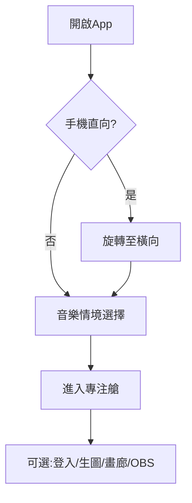

建議格式

營運管理標準手冊
針對跨區域營運團隊設計，標準化全球站與中國站的權限開通與技術管理流程。

直播主直營招募指南
面向高粉絲直播主的一對一開通流程，說明 Streamer Pass 權益與 OBS 整合方式（**不做加盟商 / Affiliate 分潤**）。

專注體驗引導手冊
引導初次使用的學生或遠端工作者，透過核心功能配置打造理想的深度專注環境。

直播技術入門教學
為初入直播領域的創作者提供 OBS 與 3D 粒子背景整合的基礎知識教學。


# Time Loop AI 完整使用說明書（繁體中文）

> **版本：** 2026-06-08 · 對應 production commit `cc4a69e`（Phase 1 Streamer Pass + 不限時觀看）
> **官方網址：** [https://app.timeloopai.net](https://app.timeloopai.net) · 中國入口：[https://cn.timeloopai.net](https://cn.timeloopai.net)

---

## 目錄

1. [第 0 章 — 產品概述](#第-0-章--產品概述)
2. [第 1 章 — 快速開始](#第-1-章--快速開始5-分鐘上手)
3. [第 2 章 — 介面總覽](#第-2-章--介面總覽)
4. [第 3 章 — 環境音樂與電台](#第-3-章--環境音樂與電台)
5. [第 4 章 — AI DJ](#第-4-章--ai-dj)
6. [第 5 章 — 視覺特效與 AI 生圖](#第-5-章--視覺特效與-ai-生圖)
7. [第 6 章 — 社群畫廊](#第-6-章--社群畫廊)
8. [第 7 章 — 陪伴工具 Companion](#第-7-章--陪伴工具-companion)
9. [第 8 章 — 登入與帳號](#第-8-章--登入與帳號)
10. [第 9 章 — 會員、點數與金流](#第-9-章--會員點數與金流)
11. [第 10 章 — 直播主專章（Streamer Pass / OBS）](#第-10-章--直播主專章streamer-pass--obs)
12. [第 11 章 — 語言與地區](#第-11-章--語言與地區)
13. [第 12 章 — 管理員操作手冊](#第-12-章--管理員操作手冊)
14. [第 13 章 — 故障排除 FAQ](#第-13-章--故障排除-faq)
15. [第 14 章 — 附錄](#第-14-章--附錄)

---

## 第 0 章 — 產品概述

### Time Loop AI 是什麼？

Time Loop AI 是一款 **3D 沉浸式專注艙 Web App**，結合：

- **3D 粒子背景** — 六種視覺特效，即時渲染
- **24h 合法 BGM** — SomaFM 等全球電台 + 大陸串流代理
- **AI DJ** — 依音樂情境切換人設，語音/字幕陪伴
- **AI 場景生成** — 文字描述生成獨特背景
- **社群畫廊** — 瀏覽、進入、發布、共專注
- **Streamer Pass** — OBS 純淨直播模式、Overlay 引流、自定義背景輪播（**創作者工具**）

### 適用場景

| 場景 | 說明 |
|------|------|
| 個人專注 | 讀書、寫程式、遠端工作 |
| 24h 無人直播 | OBS Browser Source 投屏，音訊防斷流 |
| 公開觀看 / 分享 | `?stream=1` **不限時**，最大化流量與曝光 |
| 大陸創作者 | cn 站微信手動開通，避開 Lemon 加載問題 |

### 支援網址

| 網址 | 用途 |
|------|------|
| `https://app.timeloopai.net` | 全球主站 |
| `https://cn.timeloopai.net` | 中國入口（CN 金流、串流代理優先） |

### 支援語言（10 種）

English · 简体中文 · **繁體中文** · 日本語 · 한국어 · Español · Français · Deutsch · ไทย · Tiếng Việt

---

## 第 1 章 — 快速開始（5 分鐘上手）

### 流程概覽



### 操作步驟

1. 在瀏覽器開啟 **https://app.timeloopai.net**
2. **手機使用者：** 若出現「請旋轉至橫向」提示，將裝置轉為橫向後輕觸螢幕
3. **首次使用：** 在全螢幕畫面選擇 **至少 1 種** 音樂 Mood（可複選），點 **Next**
4. 進入專注艙 — 3D 背景載入、電台自動播放
5. **（可選）** 滑鼠移入左側 → 控制面板；移入右側 → 社群畫廊

> [截圖：首次音樂 Mood 選擇畫面]

### 特殊 URL 快速入口

| URL | 效果 |
|-----|------|
| `/?stream=1` | 直接進入 OBS 直播模式（**不限時觀看**） |
| `/?world=<uuid>` | 載入指定公開世界 |
| `/world/<uuid>` | 自動跳轉至 `/?world=<uuid>` |

---

## 第 2 章 — 介面總覽

### 桌面版 vs 手機橫向

| 區域 | 桌面 | 手機橫向 |
|------|------|----------|
| 控制面板 | 左側，寬 280px，可摺疊 | 左上 **Menu** 圖示 → 左側抽屜（約 85% 寬） |
| 社群畫廊 | 右側，寬 50vw，可摺疊 | 右上 **Gallery** 圖示 → 右側抽屜 |
| 3D 背景 | 全螢幕中央 | 同左 |
| AI DJ 字幕 | 底部中央浮卡 | 同左 |
| Now Playing | 頂部中央，換台時短暫顯示 | 同左 |
| 生成中遮罩 | 全螢幕「Warping spacetime…」 | 同左 |

> [截圖：桌面版 — 左控制面板 + 右畫廊 + 中央 3D 背景]

### 面板開合規則（桌面）

- 滑鼠移入螢幕 **左側 1/3** → 左控制面板自動展開
- 滑鼠移入螢幕 **右側 1/3** → 右畫廊自動展開
- 滑鼠離開面板區域 **3 秒** → 自動收起
- 也可直接將滑鼠移入已展開的面板操作

### 鍵盤與快捷操作

| 操作 | 按鍵 |
|------|------|
| 場景命名確認 | Enter |
| 場景命名取消 | Esc |
| 關閉 AI DJ 字幕卡 | Esc |
| 全域快捷鍵（換台、全螢幕等） | **無** — 請使用控制面板按鈕 |

### 手機直向限制

手機 **直向模式** 下會顯示全螢幕旋轉提示，無法進入主介面。請旋轉至 **橫向** 使用完整功能。

---

## 第 3 章 — 環境音樂與電台

**UI 位置：** 控制面板 → **Ambient Music（環境音樂）** 區塊

> [截圖：控制面板 — 音樂區（電台、音量、DJ 開關）]

### 3.1 首次音樂情境選擇（Onboarding）

| 步驟 | 操作 | 預期結果 |
|------|------|----------|
| 1 | 在全螢幕格線中 **點選 1 個以上** Mood | 選中格高亮 |
| 2 | 點 **Next** | 進入專注艙；播放第一個 Mood 對應電台 |
| 3 | （手機） | 可能同時請求全螢幕與橫向鎖定 |

### 3.2 六種 Mood 對照表

| Mood ID | 繁中名稱 | 風格 | 預設電台方向 |
|---------|----------|------|--------------|
| neon-tokyo | 霓虹東京 | Synthwave / Cyberpunk | Synphaera Radio |
| deep-night | 深夜宇宙 | Lo-Fi Chillhop | Groove Salad |
| deep-space | 深空低鳴 | Ambient / Drone | Drone Zone |
| galactic-tavern | 銀河酒場 | Jazz / Blues | Secret Agent |
| galactic-classical | 銀河古典 | Classical / Piano | Lush |
| retro-earth | 復古地球 | 80s / 90s Retro | PopTron |

每種 Mood 也會切換對應的 **3D 背景世界**（粒子、深度圖、環境音循環）。

### 3.3 日常電台操作

| 功能 | 在哪裡 | 怎麼做 | 預期結果 |
|------|--------|--------|----------|
| 上一台 | ◀ 按鈕 | 點擊 | 播放歷史中的上一個電台；若已在最早則隨機換台 |
| 下一台 | ▶ 按鈕 | 點擊 | 依已選 Mood 隨機調頻新電台 |
| 電台名稱 | 按鈕旁文字 | — | 載入中顯示「正在掃描頻率…」 |
| 加入最愛 | ♥ 圖示 | 點擊 | 加入/移除「我的最愛」列表 |
| 音量 | 滑桿 0–100 | 拖曳 | 即時調整音樂音量；環境音約為音樂音量的 28% |
| 改 Mood | Settings 齒輪 | 點擊 | 重新進入 Mood 選擇畫面 |
| 播放最愛 | My Favorites 列表 | 點站名播放；X 移除 | 快速切換常用電台 |

### 3.4 雙路音訊

專注艙同時播放兩路音訊：

1. **電台串流** — 主要 BGM（SomaFM 等）
2. **環境音循環** — 依 Mood/世界搭配的 MP3 環境音（音量較低）

AI DJ 開口說話時，音樂音量會 **暫時降至 70%**（ducking），說完後恢復。

### 3.5 大陸串流與斷流恢復

在 **CN 區域** 或 **cn.timeloopai.net** 時，系統會優先使用 **串流代理** 播放電台。

| 情況 | 系統行為 |
|------|----------|
| 一般模式斷流 | 約 20 秒偵測 → 最多 3 次 soft reconnect → 換備援線路/換台 |
| 直播模式 `?stream=1` | **5 秒**偵測 → 無限重連 → cache-bust → tier 升級換台 |

---

## 第 4 章 — AI DJ

**UI 位置：** 音樂區的 **麥克風（DJ 語音）** 與 **定時陪伴** 開關；說話時底部中央顯示字幕卡。

> [截圖：AI DJ 字幕卡 — 人設名稱 + 口播文字]

### 4.1 六種 Mood 對應 DJ 人設

| Mood | 人設名稱（繁中介面） | 英文人設名 | 典型觸發 |
|------|---------------------|------------|----------|
| 霓虹東京 | 地下電台反抗軍 DJ | Underground Rebel DJ | 首次進艙、換 Mood |
| 深夜宇宙 | 休斯頓地面指揮官 | Houston Commander | 每日首次回訪 |
| 深空低鳴 | 潛艇 AI | Submarine AI | 定時陪伴 |
| 銀河酒場 | 深夜酒吧調酒師 | Jazz Bartender | 番茄鐘、鬧鐘 |
| 銀河古典 | 私人數位秘書 | Digital Secretary | 日曆提醒、共專注 |
| 復古地球 | 戶外探險家 | Outdoor Explorer | 各情境 fallback |

### 4.2 開關說明

| 開關 | 功能 |
|------|------|
| **DJ 語音開**（MicOn） | 口播文字 + 瀏覽器 TTS 語音 |
| **DJ 語音關**（MicOff） | 僅顯示字幕，不發聲 |
| **定時陪伴** | 週期性 DJ 問候（見下方備註） |

**關閉字幕卡：** 點擊字幕區或按 **Esc**。

### 4.3 定時陪伴 — UI 與程式差異（重要）

| 項目 | 說明 |
|------|------|
| UI 文案 | 顯示「30 分鐘陪伴」 |
| 實際程式 | 約 **每 1 分鐘** 檢查一次是否該播報（非 30 分鐘） |
| 建議 | 若需精確 30 分鐘間隔，請等待 Phase 2 修正；目前以實際體驗為準 |

### 4.4 東南亞 th / vi 硬性規則（產品設計，非 Bug）

針對 **泰語（th）** 與 **越南語（vi）** 市場：

| 層級 | 語言 |
|------|------|
| 前端 UI、Overlay 範本 | **100% 泰文 / 越南文** |
| AI DJ **口播文案**（LLM + fallback） | **固定英語** |
| AI DJ **TTS 語音** | **固定 en-US** |

**設計理由：** 規避東南亞本地 TTS 機械感，提升深夜直播間國際格調。

**操作範例：**

1. 語言選單切換至 **ไทย**
2. 控制面板、畫廊等 UI 顯示泰文
3. 開啟 DJ 語音 → 聽到 **英語** 口播，字幕亦為英語

---

## 第 5 章 — 視覺特效與 AI 生圖

**UI 位置：** 控制面板上方 — 提示詞輸入框、**Visual Effect（視覺特效）** 下拉、**Generate** 按鈕

> [截圖：場景生成區 — 提示詞 + 特效選單 + Generate]

### 5.1 六種視覺特效

| 選項（EN） | 繁中概念 | 粒子風格 |
|------------|----------|----------|
| Neon Glow | 賽博霓虹 | cyberpunk |
| Nature Particles | 自然粒子 | nature-leaves |
| Cosmic Dust | 宇宙塵 | cosmic-dust |
| Ocean Mist | 海洋霧 | underwater-mist |
| Urban Glow | 都市光 | city-light-streaks |
| Warm Haze | 暖色霧 | desert-sand-mist |

特效 **即時生效**，無需重新生成場景。

### 5.2 AI 場景生成流程

| 步驟 | 操作 | 預期結果 |
|------|------|----------|
| 1 | **Google 登入**（若尚未登入） | 完成 OAuth |
| 2 | 在提示詞框輸入場景描述（中英文皆可） | — |
| 3 | 選擇 Visual Effect | — |
| 4 | 點 **Generate** | 全螢幕「Warping spacetime…」 |
| 5 | 等待完成 | 新背景 cross-fade 切入；場景存入「我的場景」 |
| 6 | 點數扣除 | Free 每月 5 次；VIP 不限（見第 9 章） |

### 5.3 我的場景（My Scenes）

| 操作 | 步驟 | 說明 |
|------|------|------|
| **載入** | 點場景名稱 chip | 切換背景與特效 |
| **重新命名** | 點 **+** → 輸入名稱 → Confirm（或 Enter） | 需有已生成的 active 世界 |
| **刪除** | 滑鼠移入 chip → 點 **X** | 永久刪除 |
| **發布** | 點 **○**（私有）→ 確認 → 變 **●**（公開） | 公開後出現在社群畫廊 |

### 5.4 下載背景（VIP 專屬）

1. 確認帳號為 **VIP**
2. 控制面板 → **Download**
3. 瀏覽器下載目前背景 JPG（檔名 `timeloop-<worldId>.jpg`）

非 VIP 會提示升級。

---

## 第 6 章 — 社群畫廊

**UI 位置：** 右側畫廊面板 / 手機右上 Gallery 抽屜

> [截圖：社群畫廊 — 3×7 神秘格 + 分頁標籤]

### 6.1 分頁說明

| 分頁 | 內容 | 需登入 |
|------|------|--------|
| **Newest（最新）** | 最新公開社群世界 | 瀏覽否；互動要 |
| **Featured（精選）** | 官方精選世界 | 同左 |
| **Following（追蹤）** | 你追蹤的創作者作品 | 是 |
| **Official（官方）** | 21 個內建官方場景 | 否 |

底部 **More** 按鈕可載入更多（分頁 API）。

### 6.2 3×7 神秘格

社群分頁（Newest / Featured / Following）採 **3 列 × 7 行 = 21 格** 固定版面：

- 有作品的格子 → 顯示縮圖
- 空位 → 顯示 **「?」** 占位符（神秘格效果）

滑鼠移入縮圖 → 提示「Enter this timeline（進入這條時間線）」。

### 6.3 世界操作

| 操作 | 步驟 | 需登入 |
|------|------|--------|
| **進入場景** | 點縮圖 | 否 |
| **按讚** | 展開卡片 → ♥ | 是 |
| **收藏** | 展開卡片 → 書籤 | 是 |
| **分享** | Share → 複製連結 | 否 |
| **檢舉** | Report → 填原因 | 是 |

分享連結格式：`https://app.timeloopai.net/world/<世界UUID>`

### 6.4 共專注 Co-focus

1. 進入一個 **已發布的社群世界**
2. 畫廊標題區勾選 **Join co-focus（加入共專注）**
3. 標題顯示「{N} focusing now」即時人數
4. 當 **≥2 人** 同時共專注時，AI DJ 可能播報鼓勵語（每日每世界限一次）

### 6.5 追蹤創作者

1. 在展開的世界卡片點 **創作者名稱**
2. 進入 `/u/<userId>` 個人頁
3. 點 **Follow** 追蹤
4. 該創作者新作出現在 **Following** 分頁

---

## 第 7 章 — 陪伴工具 Companion

**UI 位置：** 控制面板 → **Companion（陪伴）** 區塊

> [截圖：Companion — 番茄鐘 / 鬧鐘 / 日曆]

### 7.1 番茄鐘 Pomodoro

| 控制 | 功能 |
|------|------|
| Start / Pause | 開始或暫停計時 |
| Skip | 跳過目前階段 |
| Reset | 重置計時器 |

**預設循環：** 專注 25 分 → 短休息 5 分 → … → 長休息 15 分

階段切換時 AI DJ 會播報（若 DJ 語音開啟）。狀態保存在瀏覽器 localStorage。

### 7.2 鬧鐘 Alarms

1. 用時間選擇器設定時間
2. 點 **Add alarm**
3. 列表中可 **開關** 或 **刪除** 鬧鐘
4. 時間到 → AI DJ 播報；重複模式目前為 **一次**

### 7.3 Google 日曆

| 步驟 | 操作 |
|------|------|
| 1 | 先 **Google 登入** |
| 2 | 點 **Connect Google Calendar** |
| 3 | 授權日曆讀取權限 |
| 4 | 面板顯示 **今日行程** |
| 5 | 事件開始前 **5 分鐘** → DJ 溫柔提醒 |

---

## 第 8 章 — 登入與帳號

### 8.1 Google 登入流程

1. 控制面板底部點 **Google Sign-In**（或觸發需登入的操作）
2. 跳轉 Google OAuth
3. 完成後導向 `/auth/callback` → 自動回到首頁
4. 控制面板顯示會員狀態與點數

### 8.2 需登入的功能

| 功能 |
|------|
| AI 場景生成 |
| 我的場景（儲存/改名/刪除/發布） |
| VIP / Credits 結帳 |
| 畫廊按讚、收藏、檢舉 |
| 追蹤創作者 |
| Google 日曆連接 |

### 8.3 會員狀態顯示

控制面板底部 **Membership** 區顯示：

- 剩餘 Credits
- VIP 是否生效
- 升級 / 購買按鈕（或 CN 微信面板）

---

## 第 9 章 — 會員、點數與金流

### 9.1 方案對照

| 方案 | 主要權益 | 取得方式 |
|------|----------|----------|
| **Free** | 每月 5 次 AI 生成（UI 文案） | 註冊預設 |
| **VIP** | 無限生成、下載背景 JPG | Lemon Squeezy 月訂閱（全球站） |
| **Streamer** | 自定義 Overlay、背景輪播 API、圖庫上傳 | 管理員手動開通；Lemon 第三 variant（Phase 2） |
| **Credits 包** | 額外生成點數 | Lemon 一次性購買 |

### 9.2 全球站結帳（Lemon Squeezy）

| 步驟 | 操作 |
|------|------|
| 1 | 登入後，控制面板 → **Upgrade to VIP** 或 **Buy credit pack** |
| 2 | 跳轉 Lemon Squeezy 付款頁 |
| 3 | 完成付款 → 導回 `/?checkout=success` |
| 4 | 彈窗提示「付款成功」→ 系統自動輪詢更新會員（約 18 秒） |

### 9.3 大陸站金流（cn.timeloopai.net）

大陸入口 **不載入 Lemon Checkout**（避免加載失敗）。

| 步驟 | 操作 |
|------|------|
| 1 | 開啟 cn 站或選擇「切換中國入口」 |
| 2 | 控制面板顯示 **「大陸創作者 — 手動開通」** 面板 |
| 3 | 記下 **微信客服號**（環境變數設定） |
| 4 | 點 **Copy UID** 複製你的用戶 UUID |
| 5 | 微信聯繫客服，備註「Streamer Pass」+ 附上 UID |
| 6 | 管理員後台開通（見第 12 章） |

---

## 第 10 章 — 直播主專章（Streamer Pass / OBS）

### 10.1 OBS Browser Source 設定

**推薦 URL：**

```
https://app.timeloopai.net/?stream=1
https://cn.timeloopai.net/?stream=1
```

| OBS 設定項 | 建議值 |
|------------|--------|
| 寬 × 高 | 1920 × 1080 |
| 來源類型 | Browser Source |
| 硬體加速 | 開啟 |
| 自訂 CSS | 通常不需要（頁面已純淨） |
| 音量 | 由網頁內建播放器控制；OBS 可設 100% |

> [截圖：OBS Browser Source 設定 + 直播畫面預覽]

### 10.2 直播模式顯示內容

| 顯示 | 隱藏 |
|------|------|
| 3D 粒子背景 | 左/右控制面板 |
| 雙路音訊（電台 + 環境音） | AI DJ 字幕卡 |
| Overlay 兩行 CTA（含 Emoji） | Now Playing |
| — | 音樂 Onboarding、區域提示 |

> **觀看不限時：** 所有人（含未登入）均可 **無時間限制** 觀看 `?stream=1`。Streamer Pass 解鎖的是 **創作者工具**（圖庫上傳、Overlay 編輯等），不是「解除試看」。

### 10.3 音訊防斷流（24h 直播）

直播模式啟用 **streamMode** 強化守護：

| 項目 | 一般模式 | 直播模式 `?stream=1` |
|------|----------|----------------------|
| Stall 偵測 | 20 秒 | **5 秒** |
| Soft reconnect | 最多 3 次 | **無上限**（指數退避，上限 30 秒） |
| 失敗策略 | 換 URL tier | cache-bust → tier 升級 → 換台 |

**驗收建議：** 人為斷網 5–10 秒，音訊應在 5 秒內恢復，OBS 畫面無需重載。

### 10.4 Overlay 引流文案

- 預設依 **目前 UI 語言** 套用 streamerOverlay 範本（程式檔 `lib/streamer-overlay-templates.ts`）
- 每語系 3 組「深夜專注 + 引流」範本（含 Emoji）
- 位置預設左下；可透過 API 設定（**Overlay 編輯器 UI：Phase 2**）

**繁中範例：**

- Line 1：`🌙 深夜專注艙`
- Line 2：`✨ 追蹤不迷路｜主頁有驚喜`

### 10.5 背景輪播（Streamer 專屬）

| 項目 | 說明 |
|------|------|
| 上限 | 5–10 張自訂背景 |
| 輪播間隔 | 5 或 10 分鐘（可設定） |
| 效果 | cross-fade 切換，粒子 preset 不變 |
| 上傳方式 | 控制面板 **「OBS 背景輪播」** 區塊（Streamer Pass）或 API `POST /api/streamer/backgrounds` |

### 10.6 觀看 vs 創作者權限

| 角色 | `?stream=1` 觀看 | 創作者工具 |
|------|------------------|------------|
| 未登入 / Free / VIP | **不限時** | 不可上傳圖庫、不可編輯 Overlay |
| **Streamer Pass** | 同左 | 圖庫上傳、輪播設定、Overlay 自訂 |

升級提示位於 **控制面板會員區**，不會在直播畫面中途遮罩打斷觀眾。

---

## 第 11 章 — 語言與地區

### 11.1 語言選擇

**位置：** 控制面板標題列 **地球圖示** → 下拉選單

| 語言 | 代碼 | 特殊規則 |
|------|------|----------|
| English | en | — |
| 简体中文 | zh-CN | — |
| 繁體中文 | zh-TW | 本說明書語言 |
| 日本語 | ja | — |
| 한국어 | ko | — |
| Español | es | — |
| Français | fr | — |
| Deutsch | de | — |
| ไทย | th | **UI 泰文；DJ 語音英語** |
| Tiếng Việt | vi | **UI 越南文；DJ 語音英語** |

選擇後立即生效，偏好保存在 `localStorage`（`timeloop-language`）。首次訪問會依瀏覽器語言自動偵測。

### 11.2 地區與 CN 路由

**Region Prompt（地區提示）** 出現時機：

- 偵測到 CN IP，或
- 瀏覽器語言為 `zh-cn`，且
- 不在 `cn.` 子網域，且
- 尚未儲存地區偏好

| 按鈕 | 效果 |
|------|------|
| **留在國際站** | 記住 global 偏好 |
| **切換中國入口** | 記住 cn 偏好；若設定 `NEXT_PUBLIC_CN_SITE_URL` 則跳轉 cn 站 |

**CN 站差異摘要：**

- 串流代理優先
- Lemon 結帳隱藏 → 微信手動開通
- Credits 購買按鈕亦隱藏

---

## 第 12 章 — 管理員操作手冊

> 本章供 **營運、技術管理員** 使用。需 Supabase Dashboard、GitHub Secrets、curl 等工具。  
> **產品策略：** 直營招募高粉直播主，**不做 Affiliate / 加盟商分潤**。

### 12.1 部署與環境

完整 CI/CD 說明見 [docs/github-deploy.md](github-deploy.md)。

**Push 至 `main` 分支** 會自動觸發 GitHub Actions → Cloudflare Workers 部署。

**必要 GitHub Secrets（Phase 1 新增）：**

| Secret | 用途 |
|--------|------|
| `ADMIN_API_SECRET` | 管理員 API 驗證（Wrangler secret） |
| `NEXT_PUBLIC_CN_WECHAT_SUPPORT_ID` | CN 站微信客服號（顯示於手動開通面板） |
| `NEXT_PUBLIC_SUPABASE_URL` | Supabase 專案 URL |
| `SUPABASE_SERVICE_ROLE_KEY` | 後端 service role |
| `LEMON_SQUEEZY_*` | 全球站金流 |
| `CLOUDFLARE_API_TOKEN` / `CLOUDFLARE_ACCOUNT_ID` | 部署 |

### 12.2 Supabase Migration（必做）

在 **Supabase Dashboard → SQL Editor** 執行：

[`supabase/migrations/20250605_streamer_phase1.sql`](../supabase/migrations/20250605_streamer_phase1.sql)

**建立/擴展：**

| 物件 | 說明 |
|------|------|
| `users.plan` | 擴展含 `streamer` |
| `streamer_settings` | Overlay / 輪播間隔 JSON |
| `streamer_backgrounds` | 圖庫（最多 10 張） |
| Storage bucket | `streamer-backgrounds`（公開讀） |

> Migration 中若含 `affiliates` / `affiliate_conversions` 等表，可保留於 DB 但 **應用程式已不再使用**（2026-06-08 起移除 Affiliate 功能）。

> 若 community migration 尚未執行，亦需跑 [`supabase/migrations/20250604_community.sql`](../supabase/migrations/20250604_community.sql)。

### 12.3 手動開通 VIP / Streamer（CN 微信 SOP）

**前置：** 用戶提供 **UID**（控制面板 CN 面板可複製）

**API：** `POST https://app.timeloopai.net/api/admin/grant-plan`

**Headers：**

```
Content-Type: application/json
x-admin-secret: <ADMIN_API_SECRET>
```

**Body 範例 — 開通 Streamer Pass 一年：**

```json
{
  "userId": "xxxxxxxx-xxxx-xxxx-xxxx-xxxxxxxxxxxx",
  "plan": "streamer",
  "vipUntil": "2027-06-08T00:00:00Z",
  "note": "wechat_manual",
  "addCredits": 0
}
```

**Body 範例 — 開通 VIP + 加 100 點：**

```json
{
  "userId": "xxxxxxxx-xxxx-xxxx-xxxx-xxxxxxxxxxxx",
  "plan": "vip",
  "vipUntil": "2027-06-08T00:00:00Z",
  "note": "wechat_manual_vip",
  "addCredits": 100
}
```

| 參數 | 必填 | 說明 |
|------|------|------|
| `userId` | 是 | Supabase `auth.users.id` / `public.users.id` |
| `plan` | 是 | `free` / `vip` / `streamer` |
| `vipUntil` | 否 | ISO 8601 到期日；省略或 null 表示無到期 |
| `note` | 否 | 記錄於 credit_transactions metadata |
| `addCredits` | 否 | 額外人工加點（寫入流水帳） |

**curl 範例：**

```bash
curl -X POST https://app.timeloopai.net/api/admin/grant-plan \
  -H "Content-Type: application/json" \
  -H "x-admin-secret: YOUR_ADMIN_SECRET" \
  -d '{"userId":"<UUID>","plan":"streamer","vipUntil":"2027-01-01T00:00:00Z","note":"wechat_manual"}'
```

**成功回應：** `{ "success": true, "profile": { ... } }`

### 12.4 健康檢查

```bash
curl https://app.timeloopai.net/api/health
```

**預期（金流已配置）：**

```json
{
  "ok": true,
  "env": {
    "billing": true,
    "billingMissing": [],
    "lemonWebhook": true,
    ...
  }
}
```

| 欄位 | 意義 |
|------|------|
| `billing: false` | Lemon Secrets 缺失 |
| `lemonWebhook: false` | Webhook secret 未設定 |
| `supabaseService: false` | Service role key 問題 |

### 12.5 營運 SOP 速查

| 情境 | 步驟 |
|------|------|
| **大陸主播付微信** | 收 UID → grant-plan `streamer` → 通知用戶刷新 |
| **全球 VIP 未生效** | 查 Lemon webhook 日誌 → 查 `lemon_squeezy_events` 去重表 |
| **新 migration 上線** | SQL Editor 執行 → health 檢查 → 抽測 stream API |
| **直營招募直播主** | 一對一聯繫 → grant-plan `streamer` → 提供 `?stream=1` 連結 |

---

## 第 13 章 — 故障排除 FAQ

| 問題 | 可能原因 | 處理方式 |
|------|----------|----------|
| 手機只有黑屏或旋轉提示 | 直向模式 | 旋轉至橫向，輕觸螢幕 |
| 完全沒有聲音 | 瀏覽器自動播放政策 | 點「Enter Cockpit · Enable Sound」或任意觸控解鎖 |
| 電台斷了幾秒又恢復 | 正常防斷流 | 一般模式約 20 秒；直播模式約 5 秒 |
| 大陸電台完全無聲 | 代理/網路 | 確認 cn 站；等待自動 tier 換台 |
| 生成按鈕無反應 | 未登入或點數不足 | Google 登入；確認 Credits 或升級 VIP |
| CN 站找不到 VIP 按鈕 | 產品設計 | 使用微信手動開通面板 |
| 想上傳自訂背景 / Overlay | 非 Streamer | 管理員 grant `streamer` 或等待 Phase 2 自助購買 |
| 泰文/越南文 UI 但 DJ 說英語 | **產品設計** | 東南亞市場硬性 EN 語音，非 Bug |
| admin grant 401 | Secret 錯誤 | 檢查 `x-admin-secret` 與 Wrangler secret |
| admin grant 503 | 未配置 | 設定 `ADMIN_API_SECRET` 並重新 deploy |

---

## 第 14 章 — 附錄

### 14.1 URL 參數表

| 參數 | 範例 | 效果 |
|------|------|------|
| `stream` | `?stream=1` | OBS 直播純淨模式（**不限時觀看**） |
| `world` | `?world=<uuid>` |  deep link 進入公開世界 |
| `checkout` | `?checkout=success` | Lemon 付款成功回跳（自動清除） |

### 14.2 方案權限矩陣

| 功能 | Free | VIP | Streamer |
|------|------|-----|----------|
| 專注艙 + 電台 | ✓ | ✓ | ✓ |
| AI 生成 | 5 次/月* | 無限* | 同 VIP |
| 下載背景 | ✗ | ✓ | ✓ |
| `?stream=1` 觀看 | ✓（不限時） | ✓（不限時） | ✓（不限時） |
| 背景輪播 API | ✗ | ✗ | ✓ |
| Overlay 自訂 API | 預設範本 | 預設範本 | ✓（API） |

\* UI 文案；實際扣點邏輯以伺服器 API 為準。

### 14.3 主要 API 一覽

| 端點 | 方法 | 用途 | 認證 |
|------|------|------|------|
| `/api/health` | GET | 服務健康 | 無 |
| `/api/me` | GET | 會員 profile | Bearer |
| `/api/generate` | POST | AI 生圖 | Bearer |
| `/api/checkout/lemonsqueezy` | POST | 結帳 URL | Bearer |
| `/api/streamer/settings` | GET/PUT | Overlay 設定 | Bearer |
| `/api/streamer/backgrounds` | GET/POST/DELETE | 圖庫 | Bearer |
| `/api/admin/grant-plan` | POST | 人工開通 | x-admin-secret |
| `/api/dj/greet` | POST | AI DJ 文案 | 無 |

### 14.4 Phase 2 已知限制（尚未上線 UI）

| 功能 | 現況 |
|------|------|
| Overlay 視覺編輯器 | 僅 API + 語系預設範本 |
| 背景圖庫上傳 UI | 控制面板 Streamer 區塊（Phase 1） |
| Streamer Pass Lemon 自助購買 | 需第三 variant |
| DJ 定時陪伴 30 分鐘 | UI 文案與程式 interval 不一致 |

### 14.5 修訂紀錄

| 日期 | 版本 | 說明 |
|------|------|------|
| 2026-06-08 | 1.0 | 初版：Phase 1 Streamer Pass + 10 語系 + 管理員章 |
| 2026-06-08 | 1.1 | 移除 60 秒試看與 Affiliate；`?stream=1` 不限時；Streamer Pass 改為創作者工具 gate |

---

## 相關文件

- [GitHub 部署指南](github-deploy.md)
- [Cloudflare 部署說明](cloudflare-deploy.md)
- [WaaS 直播主版產品規劃](../.cursor/plans/waas_加盟版差距規劃_980bf0c2.plan.md)（內部）

---

*如有問題請聯繫 Time Loop AI 營運團隊，或查閱 `/api/health` 確認服務狀態。*
